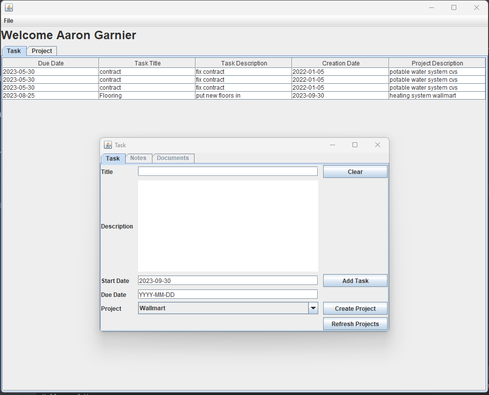
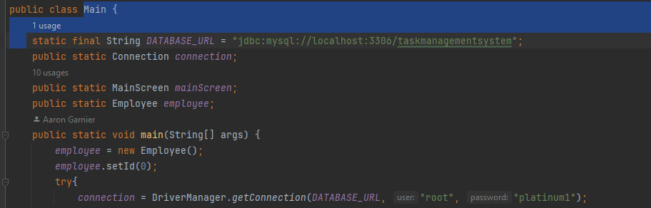

# TaskManagementSystem
## This is a task management system which utilizes Java and a my sql database to build a task system.
# Running Application

# Set up:
## Create a MySQL Database
* In Main.java
* Update DATABASE_URL with database name
* Update connection with username and password

## In folder SQLQueries:
* run CreateTables and InsertData
    * You can do this in MySQL Workbench or intelliJ Database

## Login
* You can login using the following:
  * Username: "agarnier"
  * password: "password"
    * this is preset in the code in the LoginScreen.java for testing purposes feel free to remove it.
* Or take a look at the Employees table to see other login credentials

